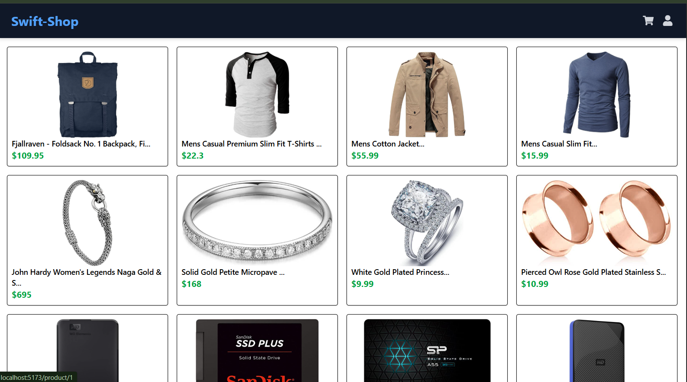

# 🛍️ ShopSwift – E-commerce App using React & FakeStoreAPI

Welcome to **ShopSwift**, a fully functional e-commerce frontend built with React, integrated with FakeStoreAPI to simulate a real online shopping experience. This project is perfect for learning and demonstrating core e-commerce features such as product listings, cart management, checkout, and authentication.

---

## 🚀 Live Demo

> [ShopSwift](https://react-swift-shop.netlify.app/)

---

## 📸 Screenshots

| Home Page                       | Product Detail                      | Cart Page                       | Checkout                                |
| ------------------------------- | ----------------------------------- | ------------------------------- | --------------------------------------- |
|  |  |  |  |

---

## 📦 Features

### 👤 Authentication

- Sign Up / Login using Fake API
- Store token in `localStorage`
- Protected Routes for Checkout & Orders

### 🛍️ Product Catalog

- Fetch products from [FakeStoreAPI](https://fakestoreapi.com/)
- Filter products by category
- Product detail page with full description

### 🛒 Shopping Cart

- Add to cart / remove from cart
- Quantity update
- Persistent cart (via `localStorage`)

### 💸 Checkout Process

- Simple checkout form
- Fake order summary & success screen

### 🧾 Order History

- Mock order data saved locally
- Users can view past orders

### 🧑‍💼 Admin Panel _(Optional)_

- Add / Edit / Delete Products (future scope)

---

## 🧱 Tech Stack

| Layer      | Technology                                |
| ---------- | ----------------------------------------- |
| Frontend   | React.js (with Vite or CRA)               |
| Routing    | React Router DOM                          |
| State Mgmt | Context API / useReducer                  |
| Styling    | Tailwind CSS / CSS Modules                |
| API        | [FakeStoreAPI](https://fakestoreapi.com/) |
| Storage    | localStorage (cart, token, orders)        |
| Auth       | Simulated JWT auth (fake login)           |

---

## 📌 Development Progress

- [✔] Project Setup
- [x] Product Listing
- [x] Product Detail Page
- [x] Cart Functionality
- [ ] User Authentication
- [ ] Checkout Page
- [ ] Order History
- [ ] Responsive Design
- [ ] Admin Panel (Optional)

---

## 🛠️ Setup Instructions

### 1. Clone the Repo

### 2. Install Dependencies

```bash
npm install
# or
yarn install
```

### 3. Run the App

```
npm run dev
# or
yarn dev
```

---

## 🧪 API Reference

Base URL: https://fakestoreapi.com

- `/products` – Get all products

- `/products/:id` – Get product details

- `/products/category/:cat` – Filter by category

- `/auth/login` – Fake login with username/password

---

## ✍️ Future Enhancements

- Admin dashboard

- Payment gateway (Stripe or Razorpay integration)

- Real-time backend (using Supabase / Firebase / Express.js)

- Product ratings & reviews

- Pagination & sorting

## 🤝 Contributing

Contributions are welcome! Fork the repo, create a new branch, and submit a pull request.
